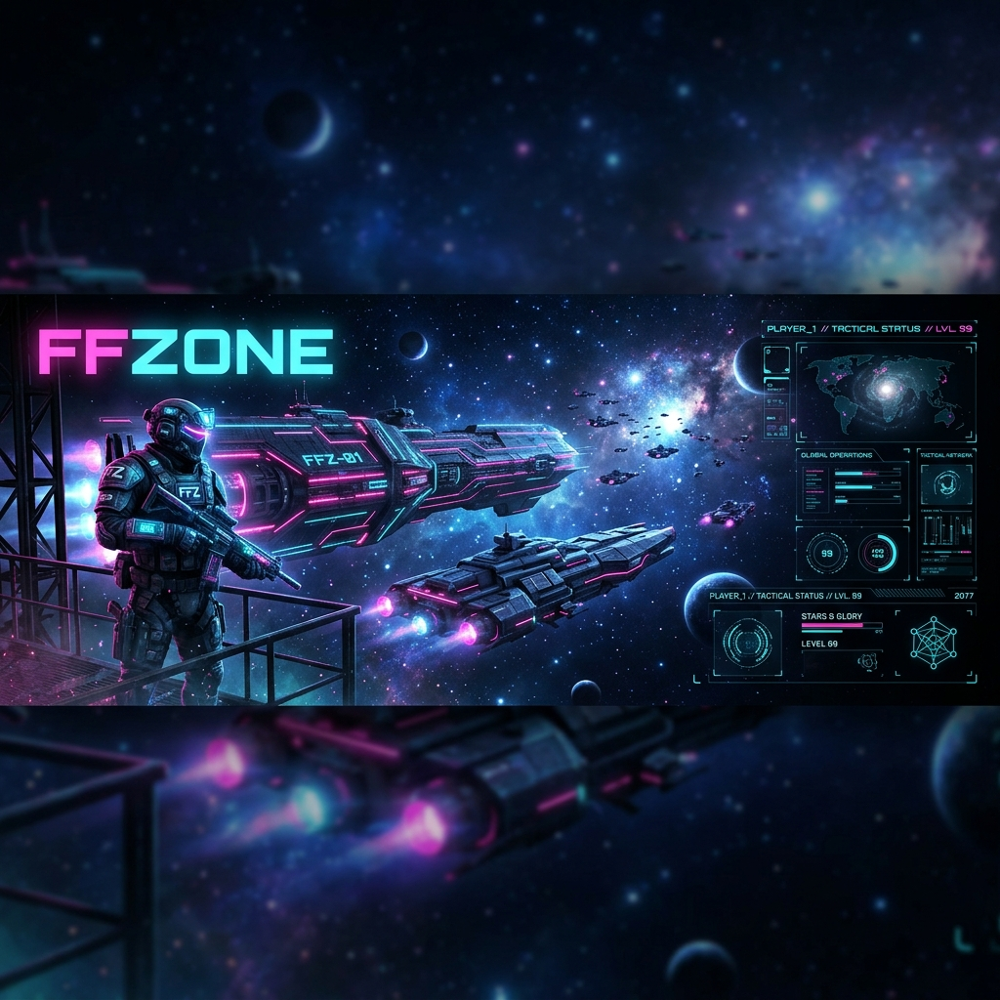

# 

<h1 align="center">🎮 FFZONE: The Ultimate Esports Hub 🚀</h1>

  

  
  
  
   
  
  
  

  

## 🌌 Overview

**FFZONE** is a high-performance, full-stack tournament management platform designed with a **Cyber-Neon** aesthetic. It brings the thrill of professional esports to every player, featuring real-time updates, secure payments, and a sleek, immersive user experience.

> [!IMPORTANT]
> This project follows the **Tactical Kineticism** design system—where speed meets precision.

  

## ✨ Key Features

<table align="center">
  <tr>
    <td align="center" width="33%">
      <h3>🏆 Tournaments</h3>
      Manage and join high-stakes tournaments with ease.
    </td>
    <td align="center" width="33%">
      <h3>🛡️ Admin Panel</h3>
      Powerful dashboard for controlling matches and users.
    </td>
    <td align="center" width="33%">
      <h3>💳 Payments</h3>
      Secure Razorpay integration for entry fees and rewards.
    </td>
  </tr>
  <tr>
    <td align="center" width="33%">
      <h3>📊 Leaderboards</h3>
      Track top players and showcase your gaming prowess.
    </td>
    <td align="center" width="33%">
      <h3>🔍 Team Finder</h3>
      Connect with pro players and build your dream squad.
    </td>
    <td align="center" width="33%">
      <h3>⚡ Real-time</h3>
      Live countdowns and instant match updates.
    </td>
  </tr>
</table>

  

## 🛠️ Tech Stack

  
  
  
   
  
  
  

  

## 🚀 Quick Start

### 📋 Prerequisites
- **Node.js** 16+
- **Python** 3.8+
- **Git**

### ⚡ One-Click Start (Windows)
We've made it simple with automation scripts:

| Action | Command |
| :--- | :--- |
| **First Time Setup** | Double-click `run_project.bat` |
| **Daily Start** | Double-click `start_servers.bat` |
| **Safe Stop** | Double-click `stop_servers.bat` |

---

## 🔌 Access Points

### 🌐 Production (Live)
- **🌍 Frontend**: [https://ffzone.vercel.app/](https://ffzone.vercel.app/)
- **⚙️ Backend API**: [https://ffzone.onrender.com](https://ffzone.onrender.com)
- **💎 Admin Panel**: [https://ffzone.onrender.com/admin](https://ffzone.onrender.com/admin)

### 💻 Local Development
- **🌍 Frontend**: [http://localhost:5173](http://localhost:5173)
- **⚙️ Backend API**: [http://127.0.0.1:8000](http://127.0.0.1:8000)
- **💎 Admin Panel**: [http://127.0.0.1:8000/admin](http://127.0.0.1:8000/admin)

  

## 📸 Screenshots

  
   
  <i>(Add more high-quality screenshots here to showcase your UI!)</i>

---

## 🤝 Contributing

Contributions are what make the open-source community such an amazing place to learn, inspire, and create. Any contributions you make are **greatly appreciated**.

1. Fork the Project
2. Create your Feature Branch (`git checkout -b feature/AmazingFeature`)
3. Commit your Changes (`git commit -m 'Add some AmazingFeature'`)
4. Push to the Branch (`git push origin feature/AmazingFeature`)
5. Open a Pull Request

  

  Made with ❤️ by <b>FFZONE Team</b>
   
  <i>Empowering gamers, one match at a time.</i>

